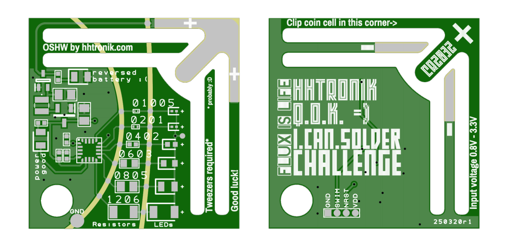
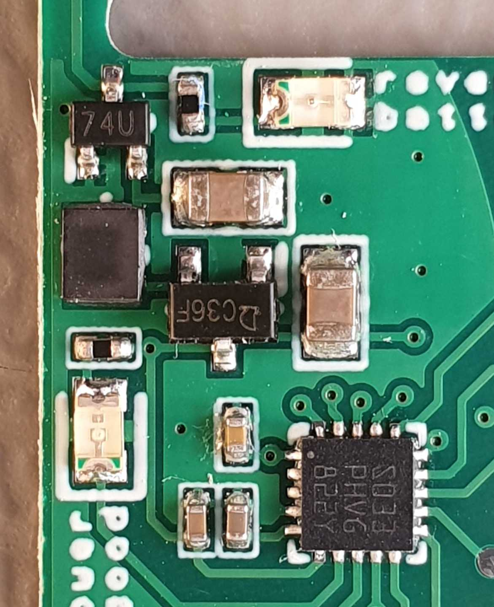

HHTronik Q.O.K. / I.CAN.SOLDER SMD Challenge
============================================

The question you always had is: how small can it get? Here's the answer: 01005 resistors (that's 0.4x0.2mm) and 0201 LEDs (0.65x0.38mm)

*The question we have is: __are you and your soldering iron ready for this challenge?__*

On this board you'll find:

- a STM8 microcontroller ready for some blinky action
- a small step up driver providing 3.6V to light those blue LEDs
- a PCB-integrated CR20xx battery holder
- polarity protection with reverse battery insertion LED
- a "power good" LED
- 12 footprints to show your soldering skill:
	- 1206 resistor and LED (3.0x1.5 mm / 0.12x0.06 inch)
	- 0805 resistor and LED (2.0x1.3 mm / 0.08x0.05 inch)
	- 0603 resistor and LED (1.5x0.8 mm / 0.06x0.03 inch)
	- 0402 resistor and LED (1.0x0.5 mm / 0.04x0.02 inch)
	- 0201 resistor and LED (0.6x0.3 mm / 0.02x0.01 inch)
	- 01005 resistor and 0201 LED (0.4x0.2 mm / 0.016x0.008 inch)
- Test points to ease probing

>
> This PCB is designed to be challenging to complete, this means you're
> likely to fail, at least for the smaller components which are super easy
> to drown in a blob of solder or to lose track of
>
> There's no way you could perform the assembly without good fine tip tweezers
> very steady hands, buckets of flux and your favourite expletives at hand!
>
> Good luck ;)
>

What equipement do I need?
--------------------------

- A great soldering iron
- Your favourite solder
- Lots of flux, because flux is life
- Fine tip tweezers
- Lots of üatience
- a multimeter (ideally with a diode test mode)

As always, work safety is important, so don't burn yourself and don't inhale the fumes released while soldering. Working in a well ventilated area is good. We'd definitely recommend adding some ventilation (for example a fan of some sort blowing the fumes away from you or a proper soldering fume extractor if you plan on doing this over and over again :)

Optionally you may have these things around:

- rubbing alcool or isopropanol
- some lint-free cloth / paper towel
- probably magnifying glasses or a binocular microscope

How should I solder that Oo?!?
------------------------------

>
> we're expecting you have some SMD soldering experience already.
> If you don't you should really go watch all of the videos below and more, and maybe
> give one of our simpler SMD kits a try first.
>
> If you feel you need a refresh on soldering SMD parts, have a look at the 
> 
>

If you chose the Standard edition, all of the above comes presoldered, which will make your life somewhat easier :) If you didn't, then - well - good luck! Especially the STM8 microcontroller is tricky to solder even though we extended the pads a bit in orders to make it at least doable for you! Our reccommendation would be to start with a single pin to tack the controller down and to do drag soldering with a chisel tip on your soldering iron. Oh! And lots of flux :)

Other than that things are pretty easy:

- the SC-70 package in the top left corner is Q1
- next to it is a R1 / 1k 0402
- top right is LED_RP / a red 0805 led
- left beneath Q1 comes L1 (a bit tricky to solder do that one first maybe? :D)
- U1 is easy peasy with its chunky SOT23-3
- the LED in the bottom right corner is LED_PG (green 0805) with it's current limiting resistor (1k 0402) just above
- the (big) 0805 MLCCs are 10uF each
- the two 0402 caps in the bottom center are both 1uF (C3 and C5)
- the single 0402 cap in the top left of the microcontroller is C4 / 100nF

Components
----------

| Ref.      | Part                        | Notes / Alternative parts  |
| --------- | --------------------------- | -------------------------- |
| Q1        | `Alpha&Omega Semi AO7401`   | `ON Semiconductor NTS2101P` / SC-70 P-Channel MOSFET (as reverse polarity protection)
| L1        | `TDK VLS252012HBU-220M`     | `Murata LQH2HPZ220MJRL` / 22uH 2.5x2.0mm inductor
| U1        | `QX2304L36T`                | Low power PFM Step up converter / SOT23-3
| U2        | `STM8S003F3U6`              | STM8 8bit microcontroller (8Kb flash, 1Kb RAM, 16MHz) / UFQFPN20
| C1        | `Samsung CL21A106KPFNNNF`   | 10uF 0805 X5R 10V MLC capacitor
| C2        | `Samsung CL21A106KPFNNNF`   | 10uF 0805 X5R 10V MLC capacitor
| C3        | `Samsung CL05B105KQ5NQNC`   | 1uF 0402 X7R 6.3V MLC capacitor
| C5        | `Samsung CL05B105KQ5NQNC`   | 1uF 0402 X7R 6.3V MLC capacitor
| C4        | `Samsung CL05B104KO5NNNC`   | 100nF 0402 X7R 16V MLC capacitor
| R1206     | `Yaego SR1206FR-7T100RL`    | 100 Ohm 1% 1206 resistor
| R0805     | `Yaego SR0805FR-7T100RL`    | 100 Ohm 1% 0805 resistor
| R0603     | `Yaego SR0603FR-7T100RL`    | 100 Ohm 1% 0603 resistor
| R0402     | `Yaego SR0402FR-7T100RL`    | 100 Ohm 1% 0402 resistor
| R0201     | `Yaego RC0201FR-07100RL`    | 100 Ohm 1% 0201 resistor
| R01005    | `Panasonic ERJ-XGNJ101Y`    | 100 Ohm 5% 01005 resistor
| LED1206   | `QTB QBLP650-IB`            | Blue LED 1206 / InGaN
| LED0805   | `QTB QBLP631-IB`            | Blue LED 0805 / InGaN
| LED0603   | `QTB QBLP601-IB`            | Blue LED 0603 / InGaN
| LED0402   | `QTB QBLP595-IB`            | Blue LED 0402 / InGaN
| LED0201_1 | `LUMEX SML-LX0201USBC`      | Blue LED 0201 / InGaN
| LED0201_2 | `LUMEX SML-LX0201USBC`      | Blue LED 0201 / InGaN
| LED_PG    | `QTB QBLP631-R`             | Red LED 0805 / reversed battery indicator
| LED_RP    | `QTB QBLP631-IG`            | Green LED 0805 / "power good" indicator
| S1        | `C&K PTS645SL50SMTR92`      | Many surface mount tactile switches with a 6x6mm outline
| BAT1      | `Keystone Electronics 3034` | `Linx Technologies BAT-HLD-001` or `MPD BK-912-TR` or `Q&J WJ-CR2032-1-W`

Firmware
--------

The firmware to flash on the microcontroller can be found in the `/firmware` folder. 
Refer to [/firmware/README](./firmware/) for instruction regarding the setup of the development environment (Platform.IO) and programming.

I don't know anything about electronics, what can I learn?
----------------------------------------------------------

Errrr.... you should probably start with some of our other soldering kits:

- [HHTronik / I learn soldering SMD Boost Edition](https://github.com/hhtronik/qok-i-learn-soldering-smd-boost) (this one might be a challenge already :)
- [HHTronik / I learn soldering SMD](https://github.com/hhtronik/qok-i-learn-soldering-smd)
- [HHTronik / I learn soldering TH](https://github.com/hhtronik/qok-i-learn-soldering-th)

LICENCE
-------

This hardware part of this project is licenced under CERN Open Hardware Licence Version 2 - Strongly Reciprocal see LICENCE file for the full text.

The firmware is released und GPL-v3 see LICENCE file in `/firmware` for the full text.